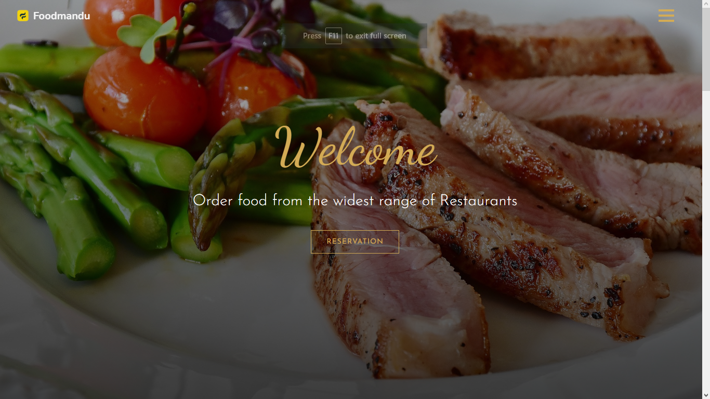

  

  <h2 align="center">Foodmandu -Food Ordering Website </h2>

Foodmandu is a culinary haven, a digital gateway to a world of flavors and gastronomic delights.This website features an intuitive user interface,
interactive content, and showcases the organization's
mission and initiatives.

<a href="https://foodmandunepal.netlify.app//"><strong>➥ Live Demo</strong></a>

 

### Demo Screeshots

### Contact

If you want to contact with me you can reach me at [LinkedIn](https://www.linkedin.com/in/stha-rabin/).

### License

This project is **free to use** and does not contains any license.
